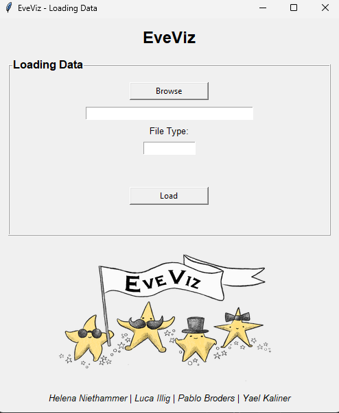
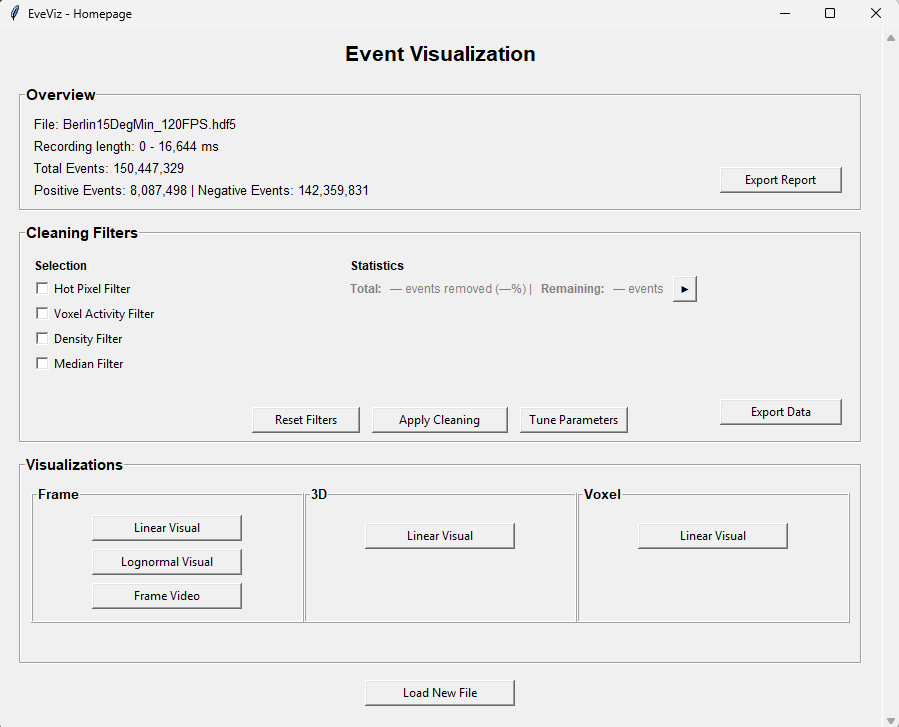
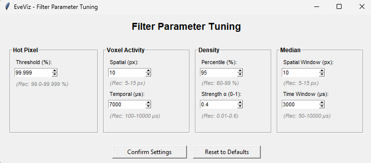
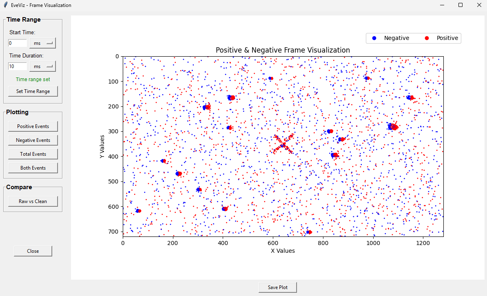
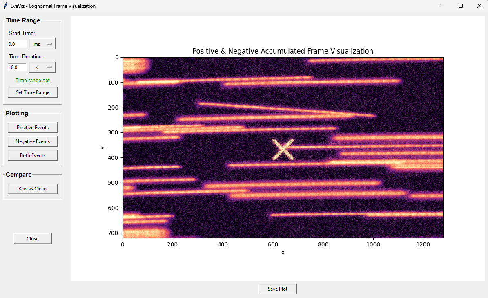
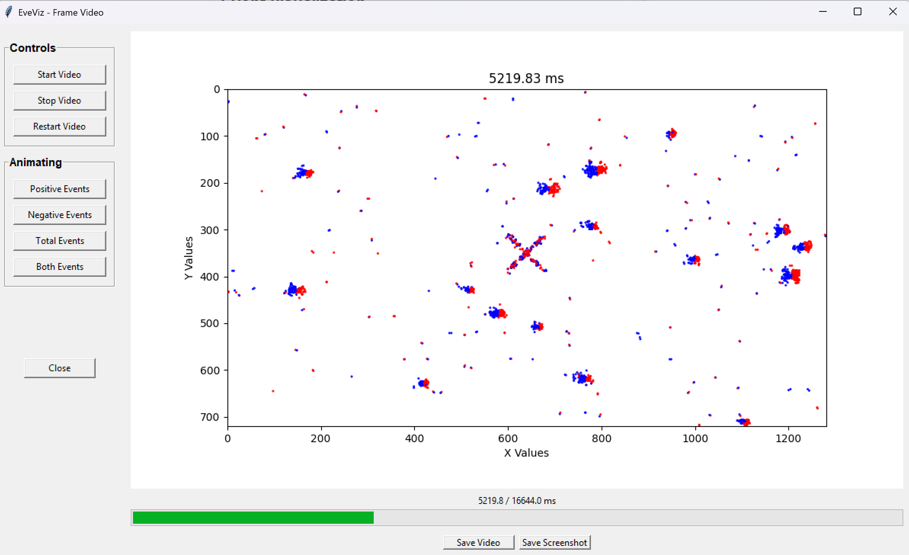
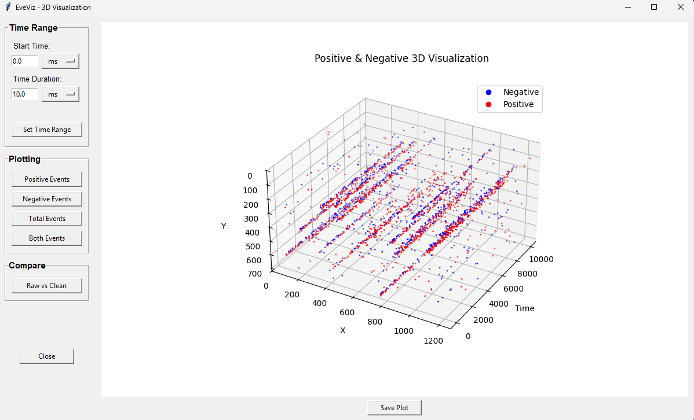
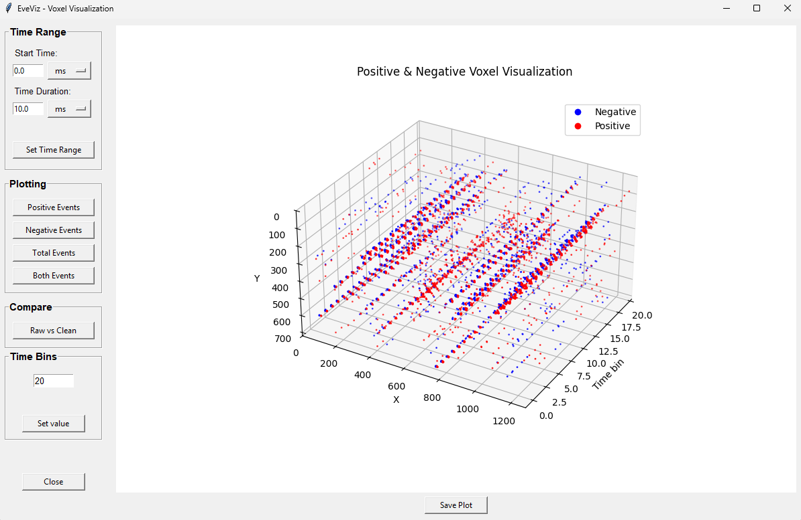

# EveViz

## Description
EveViz is a Python GUI for end-to-end event-camera data analysis and visualization. The application supports loading recordings from multiple file formats, applying configurable cleaning filters, and inspecting results in custom time ranges across multiple visualization options.

The workflow is centered around an integrated dashboard that offers cleaning filters (Hot Pixel, Voxel Activity, Voxel Density and Median) and launches 2D frame plots, 3D spatio-temporal plots, voxel-based views, and frame-video playback. Following analysis, the pipeline supports export of figures, MP4 videos, summary reports, and cleaned event data for documentation, comparison, and downstream processing.

## Detailed GUI Documentation
For full explanations of every window and feature, see:

- [Main GUI Overview](infos/EveViz_ReadMe.md)
- [Loading Data Window](infos/LoadingData_ReadMe.md)
- [Visualization Windows (2D, 3D, Voxel, Video)](infos/Visualization_ReadMe.md)
- [Cleaning Filters and Parameter Tuning](infos/CleaningData_ReadMe.md)
- [Export Features](infos/ExportingData_ReadMe.md)

---

## Installations

Ensure Python 3.10 or newer is installed, then install all required Python dependencies using:

```
pip install -r requirements.txt
```
--- 
## Additional Dependencies

The following dependencies are required to run the project and enable full functionality:

---

## FFmpeg  (required for MP4 Export)

To export video animations as MP4 files, FFmpeg must be installed and available on your system. 

1. Download the **FFmpeg full build** from 
https://www.gyan.dev/ffmpeg/builds/

2. Extract the archive and ensure the following folder exists:
```
C:\...\ffmpeg\bin
```

3. add the Bin directory `C:\ffmpeg\bin` to system PATH

4. Verify the installation by running the following command in Command Prompt:
`ffmpeg -version`

--- 

## ECF Codec (HDF5 Plugin)

The ECF filter is required to enable reading ECF event camera files via HDF5.
This guide explains how to build and install the `hdf5_ecf` plugin on Windows.

#### Prerequisites
- Windows
- Git
- CMake
- Visual Studio 2022 (MSVC)
- PowerShell


### Download HDF5

Download the following archive:
https://support.hdfgroup.org/releases/hdf5/v1_14/v1_14_6/downloads/index.html

File: 
```
hdf5-1.14.6-win-vs2022_cl.zip
```
### Extract HDF5 

1. Extract the Zip folder once 
2.  Inside the extracted folder, locate the nested ZIP archive and extract it again
3. Place the final extracted HDF5 folder in a directory of your choice

After extraction, the following path must exist: 

`C:\<your_install_path>\ecf\hdf5-1.14.6-win-vs2022_cl\hdf5\HDF5-1.14.6-win64\HDF5-1.14.6-win64\cmake\hdf5`


### Build the ECF HDF5 Plugin

Open **PowerShell** and run the following commands:

```powershell
cd C:\<your_install_path>\ecf\hdf5-1.14.6-win-vs2022_cl\hdf5\HDF5-1.14.6-win64\HDF5-1.14.6-win64\cmake\hdf5
git clone https://github.com/prophesee-ai/hdf5_ecf.git
cd hdf5_ecf
mkdir build
cd build
```

Configure the Build: 
```
cmake .. -DHDF5_DIR= "C:\<your_install_path>\ecf\hdf5-1.14.6-win-vs2022_cl\hdf5\HDF5-1.14.6-win64\HDF5-1.14.6-win64\cmake\hdf5" -DCMAKE_BUILD_TYPE=Release -DBUILD_TESTING=OFF
```
Build and register the plugin:
```
cmake --build . --config Release
setx HDF5_PLUGIN_PATH "C:\<your_install_path>\hdf5_ecf\build\Release"
```
--- 

## Event Converter BIN   (required for loading / exporting BIN files)

This section describes how to build and install the event compression executable (`Main.exe`) to run BIN files on Windows.

#### Prerequisites
- Windows
- Git
- Visual Studio Code
- C/C++ extension for VS Code
- GCC (via MinGW)


### Download and Extract the Source Code

1. Download the `eventcompression-working` ZIP archive from the LRZ GitLab  
   (repository: `event-compression`, branch: `working`).

2. Extract the ZIP file to a local directory of your choice


3. The extracted archive contains an `input` directory with example raw data.
This directory significantly increases the size of the archive.

- If disk space is limited, you may safely delete the `input` directory.
- The project will still build and run correctly.


### Install GCC (MinGW)

To compile the executable, GCC is required.

1. Follow the official Visual Studio Code guide to install MinGW:
https://code.visualstudio.com/docs/cpp/config-mingw

2. Install the **C/C++** extension in Visual Studio Code when prompted.

3. Use the default settings and installation paths recommended in the guide.

4. Ensure the MinGW `bin` directory is added to your system PATH exactly as described.

#### Verify GCC Installation

Open **Command Prompt** or **PowerShell** and run:
```
gcc --version
```

### Build the Executable
1. Open a terminal and navigate to the directory where the ZIP archive was extracted:
2. Rebuild the executable locally:
```
g++ -o Main.exe Main.cpp -std=c++17
```
3. Test the Executable by running: 
```
Main.exe c txt_Ffile_fixed_dec17.txt output.bin output.txt
```
4. Add the folder containing the executable to PATH

---
##  Metavision SDK    (required for loading RAW files)

For a detailed installation guide please follow the steps described on this website:

https://docs.prophesee.ai/stable/installation/windows.html#chapter-installation-windows

### Sections of interest during installation

1. Check `Supported Cameras` & `Required Configuration`

2. Follow the steps for `Required Artifacts`

3. Finalize the `SDK Installation`

4. In the `Additional Dependencies` section: `Installing FFMPEG` & `Installing Python` are of interest

5. Make sure you install the necessary dependencies:
```
C:\tmp\prophesee\py3venv\Scripts\python -m pip install pip --upgrade
C:\tmp\prophesee\py3venv\Scripts\python -m pip install -r "C:\Program Files\Prophesee\share\metavision\python_requirements\requirements_openeb.txt" -r "C:\Program Files\Prophesee\share\metavision\python_requirements\requirements_sdk_advanced.txt" -r "C:\Program Files\Prophesee\share\metavision\python_requirements\requirements_pytorch_cpu.txt"
```

---
## Visuals
Below are example screenshots that show the main GUI windows and their purpose.

### Loading Data
Select a file, detect its format, and load events into the shared application state.



### Event Visualization Dashboard
Review dataset statistics, apply cleaning filters, tune parameters, open visualization/export actions or return to loading data.



### Tune Parameters
Adjust filter thresholds and spatial or temporal window settings before applying the cleaning filters.



### Frame Visualization
Inspect events in 2D with polarity modes and time-window controls for fast spatial analysis.



### Lognormal Frame Visualization
Display accumulated event density with logarithmic scaling to enhance contrast in high-dynamic-range data.



### Frame Video Animation (for Datasets under 10 Million events)
Play back event activity over time and export the animation as MP4.



### 3D Visualization
Explore event distributions across space and time in an interactive 3D representation.



### Voxel Visualization
Represent the event stream in adjustable time bins to inspect local event density and structure.



---

## Tips & Troubleshooting

### General Tips
- **Start with frame times:** Use frame visualization first to understand your data before trying 3D/Voxel views
- **Iterative filtering:** Apply single filters to understand their effect, then combine
- **Memory considerations:** Very large event files (>50M events) may require patience during initial loading & cleaning processes
- **Too large time ranges:**  Large time ranges can slow down / crash the GUI due to too many events being displayed at once

### Common Issues

| Problem | Solution |
|---------|----------|
| Raw files won't load | Install the `Metavision SDK` / OpenEB and ensure the required Python dependencies are available. |
| HDF5 files won't load / export | Install the ECF HDF5 plugin and verify that `h5py` can access the compressed dataset. Additionally, make sure that the `HDF5` file is only containing exactly one dataset. |
| BIN files won't load / export | Install the BIN converter (`Main.exe`) and add the executable folder to the system `PATH`. |
| Video can't be played | Reduce the dataset by using filters to fewer than 10 million events before opening the frame-video view. |
| Video export fails | Install FFmpeg and ensure `ffmpeg` is available in the system `PATH`. Verify with `ffmpeg -version` in a terminal. |
| Filters remove too much / too less | Open **Tune Filter Parameters** and adjust the filter thresholds and spatial or temporal windows; larger windows reduce filtering, smaller windows increase it. |

---

## Authors
The original authors of EveViz are: 
Helena Niethammer: helena.niethammer0105@gmail.com
Luca Illig: luca3.illig@gmail.com
Pablo Broders: broderspablo@gmail.com
Yael Kaliner: yaelkaliner@gmail.com

Ongoing maintenance of the tool is done by Dr. Sydney Dolan.

## Citation
If you found the tool helpful in your work, we ask you use the following bibtex citation!
```bibtex
@article{EveViz2026,
  title={EveViz - Visualization Toolkit for Astronomical Event Data},
  author={Kaliner, Yael and Illig, Luca and Broders, Pablo and Niethammer, Helena},
  year={2026}
}
```
## Acknowledgment
Many thanks to the continued support and supervision of Dr. Sydney Dolan and Lara Illig for designing our projects logo.
